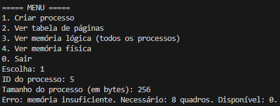
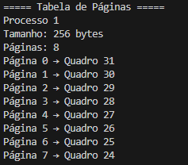
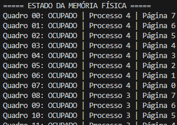

# Gerenciamento-de-Memoria-com-Paginacao-Sistemas-Operacionais

## Compilando o programa e executando o programa:

Rode no terminal do projeto os seguintes comandos:
Para compilar:
```gcc main.c -o main```

Para inicializar:
```./main```

## Detalhes da implementação:

### 1. **Inicialização da Memória Física e Lógica**
- Memória física: vetor `Frame` (global `physical_memory`).
- Memória lógica é representada indiretamente pelas tabelas de páginas e pelos quadros físicos. A inicialização aleatória é feita nos quadros (em `create_process`).
- **Função `initialize_memory()`**:
        - Faz uma divisão da memória física em quadros de acordo com o tamanho de `PAGE_SIZE`.
        - Dá um start em cada quadro como livre, sem processo associado e sem dados.
        - Constrói uma linked list de quadros livres (`free_frames_list`)

### 2. **Estruturas de Dados**
   - **Frame (Quadro)**: Uma struct/"objeto" que representa um quadro na memória física:
        - `process_id`: Processo que ocupa o quadro.
        - `page_num`: Número da página que está no quadro.
        - `data`: Array de bytes
        - `is_free`: Flag que indica a disponibilidade do quadro.
        

### 3. **Criação de Processos**
   - **Função `create_process(process_id, size)`**:
        - Verifica duplicações em `process_id` e verifica se o tamanho do processo excede `MAX_PROCESS_SIZE`
        - Calcula quantas páginas serão utilizadas (`page_count`).
        - Verifica se há quadros livres suficientes em `free_frames_list`, uma lista que representa a alocação não contigua.
        - Faz a alocação da estrutura do processo e da tabela de páginas.
        - Para cada página:
            - Remove um quadro da lista de quadros livres.
            - Marca como ocupado, associando ao processo e à página.
            - Preenche o quadro com valores aleatórios.
            - Atualiza a tabela de páginas.
        - Acrescenta este processo ao array em `processes`.

### 4. **Visualização da implementação**
   - **Função `print_page_table(process_id)`**:  
        - Busca o processo através do seu `process_id`, exibindo seu tamanho e número de páginas. Exibe também o número do quadro físico.
   - **Função `list_all_processes()`**:  
        - Exibe uma listagem com os dados dos processos criados.
   - **Função `show_physical_memory()`**:
        - Avalia cada quadro na memória física, informando se ele está livre ou não. Quando estiver ocupado, informa o ID e número da página
   - **Função `main()`**:
        - Contém a interface do usuário com os botões para criar processo e verificar tabela de páginas, memória lógica e física.

## Atendimento dos requisitos:
**Ao inicializar, o sistema solicita estas 3 configurações**.
   - 1. Configuração de Tamanho de Memória Física (padrão: 1024)

   - 2. Configuração de Tamanho da Página (padrão: 32): 
   - 3. Configuração de Tamanho Máximo de um processo (padrão: 256)

## Exemplo simulado

No exemplo abaixo, utilizamos as configurações padrão (memória física: 1024, tamanho de página: 32, tamanho max. do processo 256) para simular um erro de memória insuficiente. O erro ocorreu porque o 5° processo criado com tamanho 256 excede os 1024 bytes totais:



Neste outro exemplo, conseguimos visualizar o processo 1, que foi criado com tamanho 256 e alocado nas respectivas páginas/quadros abaixo.

Utilizar a função **3.** do menu retorna um resultado semelhante, exibindo todos os preocessos criados.



Por último, é possível visualizar a ocupação da memória física, através da função **4.** do menu.



## Desenvolvido por:
- Felipe Delduqui Alves Pinto Flávio (23100769)
- Arthur Paulo Rodrigues (23100747)
- Roberto Gabriel Ferreira (23100739)